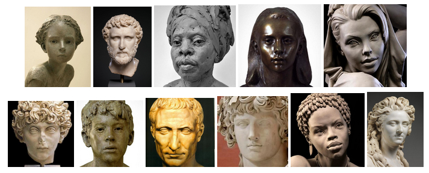
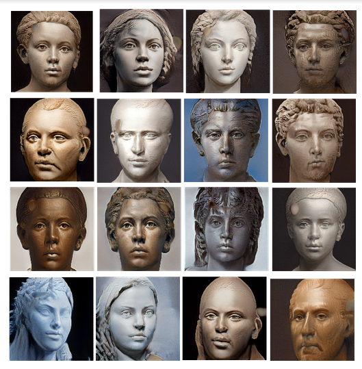

# StatueStyleGAN
This repository contains the tensorflow implementation of "A Style-Based Generator Architecture for Generative Adversarial Networks" paper by Karras et al. (https://arxiv.org/abs/1812.04948).

The dataset used for this work was manually gathered from pinterest (http://bit.ly/2GGNMIZ) and image preprocessing techniques such as cropping and resizing was peformed on these images afterwards.

The training and testing code can be found in the jupyter notebook.

## Pretrained Model 
The Pretrained model for this work can be found here: http://bit.ly/2yGCnEF

## Excerpts of Training data

## Results

